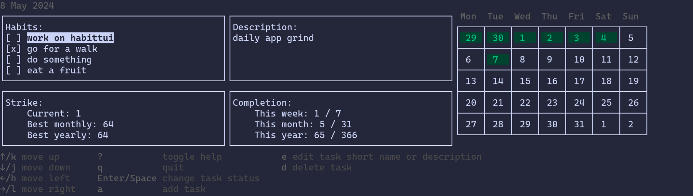

# habittui
This is my terminal application for managing daily habits.
Rationale for this app is that I spend most of the day in terminal as my setup is neo-vim + tmux. 
Having habit tracking app inside of terminal is more convenient for me than mobile or web app. 
## Initial project:
The terminal will be split in at least 3 separate windows. Name window is used interchangeably as section.
```
----------------------------------------------------------|
| Tasks (today):             | Description:               |
|  (short name)              |                            |
| [x] Work on habitui        |  Extended description of   |
| [x] Go for a walk          |  task that can be edited   |
| [ ] Do english lesson      |                            |
|                            |                            |
| Shows tasks for today.     |                            |
|----------------------------|-----------------------------
| Strike statistics:         | Completion statistics:     |
|                            |                            |
|   Current: 2 days          | This week: 2 times         |
|   Best monthly: 5 days     | This month: 10 times       |
|   Longest: 10 days         | This year: 50 times        |
|                            |                            |
|                            |                            |
|----------------------------|----------------------------|
```

## Navigation and controls
j - Navigate up in current window, in Tasks windows this will highlight (or change color of) currently selected task. <br>
k - Navigate down in current windows, in Tasks windows. <br>
l - Navigate to window right, for example from tasks to description window. This will somehow highlight (or color change) other window.  <br>
h - Navigate to window left. <br>
e - Edit data in current window. Allows to edit task short name or description.
        After edit, user press enter and a pop up with confirm changes 'y/n' will come. <br>
a - add new task and move into task name/description edit mode. <br>
d - Deletes currently selected task, a confirmation window will pop up. <br>

## Consistent state 
Task and their changes are saved in json file by default its `.habitui.json`.

## Developement status
App dev in progress.

## Installation
To install `habitui` binary in your GOPATH:
```
go install github.com/bazko1/habitui/cmd/habitui@latest
```

## Usage 
Run `habitui`. <br>
This lets you create new habits. If you do not provide `-data` flag data will be saved to `$HOME/.habitui.json`

## How it looks:

