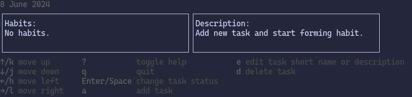
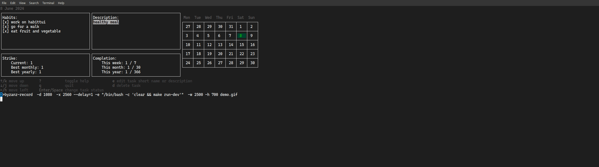

# habittui
This is my terminal application for managing daily habits.
Rationale for this app is that I spend most of the day in terminal as my setup is neo-vim + tmux.
Having habit tracking app inside of terminal is more convenient for me than mobile or web app.

## Initial project:
The terminal will be split in at least 3 separate windows. Name window is used interchangeably as section.
```
----------------------------------------------------------|
| Tasks (today):             | Description:               |
|  (short name)              |                            |
| [x] Work on habitui        |  Extended description of   |
| [x] Go for a walk          |  task that can be edited   |
| [ ] Do english lesson      |                            |
|                            |                            |
| Shows tasks for today.     |                            |
|----------------------------|-----------------------------
| Strike statistics:         | Completion statistics:     |
|                            |                            |
|   Current: 2 days          | This week: 2 times         |
|   Best monthly: 5 days     | This month: 10 times       |
|   Longest: 10 days         | This year: 50 times        |
|                            |                            |
|                            |                            |
|----------------------------|----------------------------|
```

## Navigation and controls
j - Navigate up in current window, in Tasks windows this will highlight (or change color of) currently selected task. <br>
k - Navigate down in current windows, in Tasks windows. <br>
l - Navigate to window right, for example from tasks to description window. This will somehow highlight (or color change) other window.  <br>
h - Navigate to window left. <br>
e - Edit data in current window. Allows to edit task short name or description.<br>
        After edit, user press enter and a pop up with confirm changes 'y/n' will come. (confirm not yet implemented)  <br>
a - add new task and move into task name/description edit mode. <br>
d - Deletes currently selected task, a confirmation window will pop up. (pop up not yet implemented) <br>

## Consistent state
Task and their changes are saved in json file by default its `.habitui.json`.

## Developement status
App dev in progress.

## Installation
To install `habitui` binary in your GOPATH:
```
go install github.com/bazko1/habitui/cmd/habitui@latest
```

## Usage
Run `habitui`. <br>
This lets you create new habits. If you do not provide `-data` flag data will be saved to `$HOME/.habitui.json`<br>
Alternatively you can user remote server instead of local file:
```
habitui -remote-password "$PASSWORD" -remote-user "$USER" -remote-server "http://your-remote.com" -enable-remote
```

### Client parameters
```
Usage of ./habitui:
  -data string
        file name for loading/saving tasks data
  -enable-remote
        enable storing data into remote location
  -no-debug
        do not log debug data to file
  -remote-password string
        password for remote login
  -remote-server string
        address of remote server for loading saving tasks data (default "localhost:3000")
  -remote-user string
        username for remote login
```

## Serving data remotely
You can use server tool for storing/serving your habit data via http rest api.<br>
To install `habitui-server` binary in your GOPATH:
```
go install github.com/bazko1/habitui/cmd/habitui-server@latest
```
Currently remote server supports two types of controller inmem that stores all the data in memory and sqlite based.

### Server parameters
```
Usage of ./habitui-server:
  -engine string
        engine to use for controller supported: 'inmem', 'sqlite' (default "inmem")
  -hostname string
        host name or ip to serve on (default "localhost")
  -port int
        port to serve on (default 3000)
  -timeout int
        read timeout milliseconds (default 100)
```

## How it looks:
Main window no habits yet added:<br>

<br>Main window with habits:<br>

<br>Selection highlighting:<br>

<br>Editing task name:<br>


### Demo


## Things to do first
 - [ ] Move demo to asciinema 
 - [ ] Add popup or configuration that allows you to edit habit occurrence period (every day, two, n days, once a week / month, quarterly etc.
## Known issues and todos:
 - Typing name or description that is longer than width can at point just before line break extend selection to whole line selecting text that shouldn't be selected. 
 - If name or description is multi line the second line and subsequent lines will not take full box width.
 - Depending on number of tasks or number of lines for task name or description the calendar can be spaced a bit differently and week day names are not in leveled with top box border.
 - In some task number configuration current date has extra newline and is not directly over tui boxes.
 - Best monthly strike implementation does not provide much information as it will show longest strike that was finished current month. <br>
   If strike is over 31 days and was stopped this month then it will be displayed best strike whole month. <br>
   It would make sense to reimplemented this logic so that it shows values from 0-31 counting strikes only during current month.
  - I would like to add another controller for server supporting mongodb.
  - Add possibility to being asked for remote password securely in cli instead of providing as command line argument.
